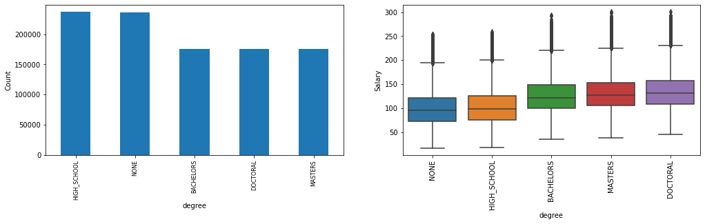

# Salary Prediction Project (Python)

### **Define the Problem** 

**Project Goal:** The goal of this project is to analyze a dataset of job listings with posted salaries and predict the salaries of job listings that neglected to post a salary. 

**Use Case:** This type of model could be utilized by either recruiting firms or individual companies attempting to remain competitive in the job market.

**Tools:** The problem has been approached using Python 3 with machine learning algorithms/estimators from sklearn and xgboost.

### Description of Data

**The datasets given are as follows:**

train_features.csv: This file contains one million observations, each one representing an individual job listing, along with 8 features. One of these features, "jobId", is a unique identifier and was not utilized in the models construction for prediction. The remaining 7 features are described below.

train_salaries.csv: This file contains the salaries for the observations in train_features.csv along with their corresponding identifier.

test_features.csv: Silimar to train_features, however, an accompanying "test_salaries" csv is not provided.

**Features**

* companyId (categorical) - A company identifier (not utilized in final model)
* jobType (categorical) - Junior, Manager, Vice President, CEO, etc.
* degree (categorical) - High School, Bachelors, Masters, etc.
* major (categorical) - Chemistry, Math, Physics, etc.
* industry (categorical) - Auto, Health, Finance, Oil, etc.
* yearsExperience (numerical) - Desired years of experience of candidate
* milesFromMetropolis (numerical) - Job location's distance from metropolis

### Steps of Data Exploration

1. Import relevant libraries
    * pandas, numpy, matplotlib, seaborn, sklearn, xgboost, and pickle
2. Load the data into pandas DataFrames
3. Examine the structure of the data sets
4. Clean the data
    * Merge the features and salaries DataFrames on 'jobId' for easier handling
    * Check for missing values
    * Check for duplicate observations
    * Check for invalid data - rows with salaries equal to 0 are dropped
5. Vizualize the data (shown in Data Vizualization section below)
    * Bar plots for counts
    * Box and whisker plots for each category by salary
    * Line graphs for numerical features vs salary
6. Examine correlation between features/features and features/target (shown in Data Vizualization section below)
    * Heatmap correlation matrix
7. Run baseline model
    * A simple multiple linear regression model
8. Hypothesize feature engineering to improve accuracy over baseline model
    * Data trasformations
    * Binning
9. Hypothesize different estimators to improve accuracy over baseline model
    * Stochastic Gradient Descent
    * Decision Tree
    * Random Forest
    * Xgboost
10. Choose most accurate model and fine-tune hyperparameters
11. Build a pipeline for deployment

### Data Vizualization

* **'jobType'**

   * The count for each category is evenly distributed.
   * The average salary increases as category progresses from Janitor to CEO.
   * There is a clear relationship between jobType and salary.

* **'degree'**

   * Most of the job listings do not require a degree or high school diploma.
   * The average salary increases with any type of degree.
       * There is not much variance in salary across the different levels of degrees, only slightly.
       * Binning into 'degree' and 'no degree' did not increase accuracy of model.
   * There is a clear relationship between degree and salary. 

* **'major'**

   * Most of the job listings don't specificy a required major. This could be because either the candidate's major is insignificant, or that a candidate does not have major if they do not have a degree. It looks like a combination of both reasons.
   * When there is a required major, there tends to be a correlation with salary, with the Engineering major receiving the highest.
    
* **'industry'**

   * The count for each category is evenly distributed.
   * The average salary is lowest for jobs in education while being the highest for jobs in the oil industry.
   * There is a clear relationship between industry and salary.

* **'yearsExperience'**

   * There is an even distribution of years experience across the job listings.
   * There is a strong positive linear relationship between years experience and salary.
       * The more experience a candidate has, the higher the salary.

* **'milesFromMetropolis'**

   * There is an even distribution of miles from metropolis across the job listings.
   * There is a strong negative linear relationship between miles from metropolis and salary.
       * The further the job is from the metropolis, the lower the salary.
        
**Correlation Matrix**

   * The heatmap confirms correlation between jobType, degree, and major. It also confirms that there is a strong positive correlation between years experience and salary, as well as a strong negative correlation between miles from metropolis and salary.
   * There is little concern of correlation between features, as the strongest correlation is between degree and major at 0.37. 
   * CompanyId has negligible correlation with salary, therefore it was removed from the final training set.
    
### Run Baseline Model

* A multivariable linear regression model was chosen as the baseline model due to its simplicity and the apparent linear relationships between the features and salary.
* The basic linear regression model, with default hyperparameters, achieved a baseline MSE score of approximately 925.
* An MSE-Score <360 was targeted for the more complex models as discussed below.

### Hypothesize

* Feature engineering
    * Different types of data transformations - Dummy encoding showed most improvement.
    * Binning degree, major, yearsExperience, and milesFromMetropolis features - These ideas did not show any improvement.

* Estimator improvements
    * Stochastic Gradient Descent (SGD) - Works well with large number of observations (>100K), may show improvement over linear regressor.
    * Decision Tree (DTR) - The data is simple enough for binary splitting.
    * Random Forest (RF) - If moving forward with dummy encoding and creating more variables, this algorithm could provide higher accuracy over decision tree.
    * Xgboost (XGB) - Powerful boosting esemble that can optimize on least squares regression.

### Model Development

* Choose most accurate model
    * Initial hyperparameters were chosen manually and revised based on their performance.
    * Five-fold cross validations were performed to establish bias and variance levels.

   * Xgboost was the best performing model with an MSE-Score of 356.

* Fine-tune Xgboost regressor

   * The optimal n_estimators value was 500 or greater while max_depth = 5 and learning_rate = 0.1.

   * The optimal max_depth value was around 4 while n_estimators = 750 and learning_rate = 0.1 as the test_error curve begins to diverge from the train_error curve at that point.

   * The optimal learning_rate value could be between 0.05 and 0.10 while max_depth=4 and n_estimators=750. It's possible that the model with learning_rate=0.05 was unable to converge, therefore early stopping was explored with this learning rate.
    
* After fitting the data and applying early stopping, the number of rounds in which the accuracy does not increase significantly is after n_estimators=1500.
    
* The hyperparameters used for model deployment are as follows;
    * n_estimators=1500
    * max_depth=4
    * learning_rate = 0.05

* The entire dataset was fit to these model settings and produced a five fold cross validation mse-score of about 355. The model accuracy barely increased, but these new hyperparameters were still utilized for deployment. The accuracy of the model may be at its limit, unless deeper feature engineering is explored.

* A feature importance graph was plotted from the results of the data being pushed through this model and the results can be seen below;

> Its clear that yearsExperience and milesFromMetropolis are the most important variables for this model, as expected from the correalation heatmap produced earlier.

### Model Deployment

* The type of estimator and its hyperparameters were chosen as described above.
* The preprocessing, feature engineering, and model training were assembled into a pipeline which the original dataset was pushed through.
    * The pipeline function exported a 'model' file that can be shared.
* A separate notebook file named 'Salary_Prediction_Module.ipynb' with the salary_prediction_model class was created.
    * The salary_prediction_model class contains functions to export new salary predictions and a feature importance graph.
* In a new notebook, with the Salary_Prediction_Module.py file and the 'model' file in the same folder, any user can obtain salary predictions with the following code;

    from Salary_Prediction_Module import *

    model = salary_prediction_model('model')

    model.export_predictions("enter file name here")

    model.export_feature_importance()

* See 'Salary_Predictor.ipynb' for example.
* See 'predicted_salaries.csv' for salary predictions of 'test_features.csv'

